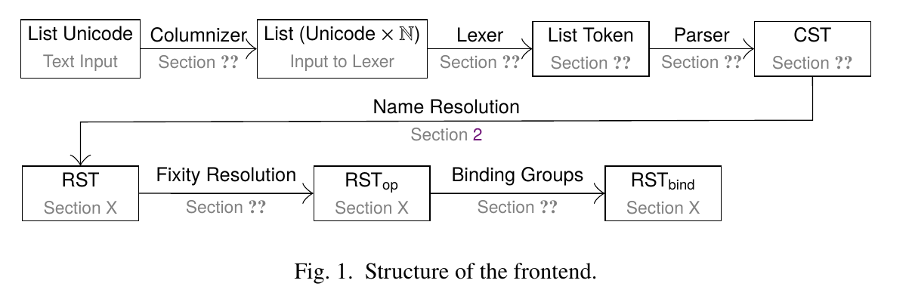

# Specification of the Haskell Module System

Welcome to my project for Zurihac 2026! Contributors are very welcome!

## Background

I am in the process of writing a complete formal specification of the Haskell 2010 language.
This includes both a classical PDF paper with nicely layouted inference rules and explanations,
and a mechanization of these typing rules in a proof assistant. The pen-and-paper specification is
designed to be proof-assistant agnostic, i.e. no advanced features like coinductive types, fancy induction-recursion,
or cubical Agda etc are allowed. It should be possible to mechanize the specification in any dependently-typed proof assistant.
For various reasons I have chosen Lean to implement the rules myself, but I would be happy to see a mechanization in other proof assistants as well.

## This Project

For this Zurihac I am targetting one small step in the overall structure of the verified frontent: Name resolution i.e. the semantics of the module system.
Here is an overview of the bigger compiler pipeline from the paper.
We are targetting the step from CST to RST:



Intuitively, what this step does is to explain the meaning of the various import and export statements in the header of a Haskell module:
```haskell
module A ( foo, module B)

import B
import qualified C as D hiding (bar)
...
```
In that process, all qualified and unqualified names in the module are replaced by fully resolved _original names_. 
Original names, the naming follows the paper of Faxen, are written `A.B!f`. They look similar to fully qualified names, but always refer to the name of the original module, whereas a qualified name can refer to a renamed module.
Consider the following module:

```haskell
import A as B

f = B.foo
```
after renaming we have
```haskell
f = A!foo
```

## Structure

```text
├── haskell                 A Haskell implementation of the algorithm of the paper.
├── latex                   Section of a larger article on Haskell's frontend.
├── lean                    The Lean formalization corresponding to the formal rules.
└── sketches                Lean and Haskell code for the Diatchki et al. paper
```

## References

- Diatchki, Jones, Hallgren.  A formal specification of the Haskell 98 module system. [ACM DL](https://dl.acm.org/doi/10.1145/581690.581692)
- Faxén. A static semantics for Haskell. [Cambridge JFP](https://www.cambridge.org/core/services/aop-cambridge-core/content/view/9D90E0C7DE8DA7D6BAEAC5143E658E1D/S0956796802004380a.pdf/static_semantics_for_haskell.pdf)
- Haskell 2010 Language Report [Report](https://www.haskell.org/onlinereport/haskell2010/)